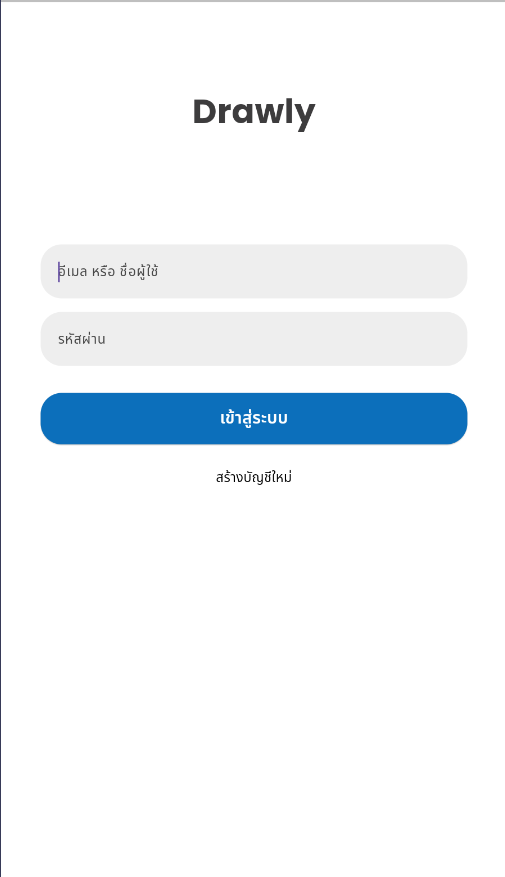
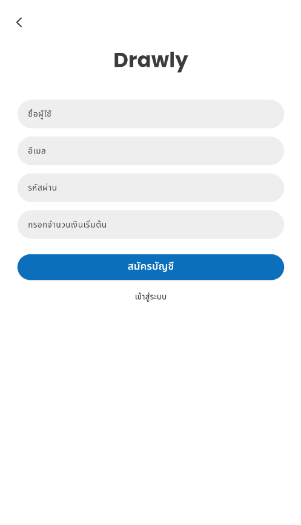
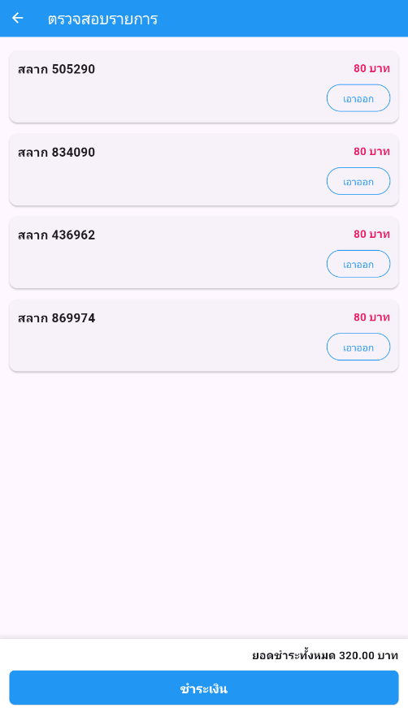

# Drawly - Online Lottery Application

A cross-platform mobile lottery application built with Flutter. It provides interfaces for both users (browsing, purchasing in cart, checking & claiming prizes) and administrators (generating tickets, drawing prizes, resetting system), using Firebase Firestore for backend services.

## User Interface Demo

### 1. Authentication & Registration Flow
A secure login and registration onboarding flow.

| Login Screen | Registration Screen |
| :---: | :---: |
|  |  |
| Account Login with Email/Username | Account registration with name, email, and password |

---

### 2. Main Dashboards
Dedicated user and admin hub layouts.

| User Home Dashboard | Admin Home Dashboard |
| :---: | :---: |
|  |  |
| Browse lottery tickets, search numbers, view cart, and check winning history | Access configuration options: generate tickets, random numbers, and draw prizes |

---

### 3. User Lottery Purchase & Checking Flow
Seamless workflow for users to search, purchase, and verify their lottery tickets.

| Buy Lottery Screen | Shopping Cart | My Lottery | Check Prize Screen |
| :---: | :---: | :---: | :---: |
|  |  |  |  |
| Browse and select available lottery tickets | View pending tickets and check out using wallet | View purchased lottery tickets history | Verify ticket numbers and claim prizes |

---

### 4. Admin Lottery Management & Draw Flow
Powerful utilities for administrative management of lottery ticket generation and drawing.

| Admin Add Lottery | Admin Random Lottery | Admin Confirming Draw |
| :---: | :---: | :---: |
|  |  |  |
| Select ticket quantity to generate and insert into the stock | Perform random prize draws for regular and matching numbers | Declare officially drawn winning tickets and confirm results |

---


## Features

* **User Features**:
  * Registration and login interface.
  * Search, browse, and purchase lottery tickets.
  * Shopping cart to select multiple tickets before checkout.
  * Real-time claim prize system directly reflecting on wallet balance.
* **Admin Features**:
  * Generate batches of random lottery tickets.
  * Draw winning numbers (First, Second, Third prizes, 3-digit, and 2-digit).
  * System reset capability (wipes records while retaining credentials).
* **Backend Integration**: Connected to Node.js/Express API powered by Firebase Firestore.

## How to Run

### Prerequisites
* Flutter SDK installed.
* Connected simulator/emulator or physical mobile device.

### Compilation and Execution

1. Fetch project dependencies:
   ```bash
   flutter pub get
   ```

2. Run the application:
   ```bash
   flutter run
   ```

